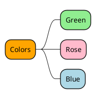
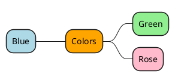
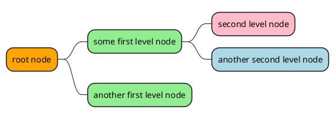
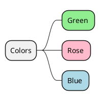
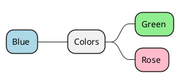
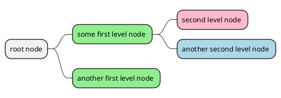
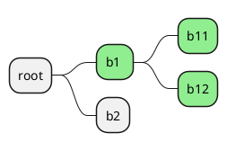

```plantuml
@startmindmap
*[#Orange] Colors
**[#lightgreen] Green
**[#FFBBCC] Rose
**[#lightblue] Blue
@endmindmap

```

```plantuml
@startmindmap
+[#Orange] Colors
++[#lightgreen] Green
++[#FFBBCC] Rose
--[#lightblue] Blue
@endmindmap
```

```plantuml
@startmindmap
*[#Orange] root node
 *[#lightgreen] some first level node
  *[#FFBBCC] second level node
  *[#lightblue] another second level node
 *[#lightgreen] another first level node
@endmindmap

```

```plantuml
@startmindmap
<style>
mindmapDiagram {
  .green {
    BackgroundColor lightgreen
  }
  .rose {
    BackgroundColor #FFBBCC
  }
  .your_style_name {
    BackgroundColor lightblue
  }
}
</style>
* Colors
** Green <<green>>
** Rose <<rose>>
** Blue <<your_style_name>>
@endmindmap
```

```plantuml
@startmindmap
<style>
mindmapDiagram {
  .green {
    BackgroundColor lightgreen
  }
  .rose {
    BackgroundColor #FFBBCC
  }
  .your_style_name {
    BackgroundColor lightblue
  }
}
</style>
+ Colors
++ Green <<green>>
++ Rose <<rose>>
-- Blue <<your_style_name>>
@endmindmap

```

```plantuml
@startmindmap
<style>
mindmapDiagram {
  .green {
    BackgroundColor lightgreen
  }
  .rose {
    BackgroundColor #FFBBCC
  }
  .your_style_name {
    BackgroundColor lightblue
  }
}
</style>
* root node
 * some first level node <<green>>
  * second level node <<rose>>
  * another second level node <<your_style_name>>
 * another first level node <<green>>
@endmindmap

```

```plantuml
@startmindmap
<style>
mindmapDiagram {
  .myStyle * {
    BackgroundColor lightgreen
  }
}
</style>
+ root
++ b1 <<myStyle>>
+++ b11
+++ b12
++ b2
@endmindmap

```
