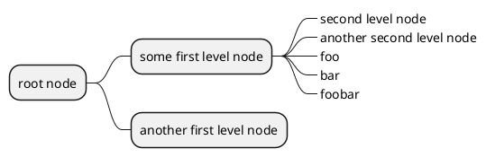
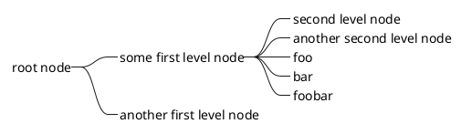
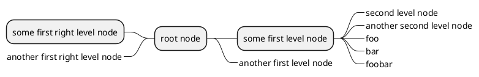
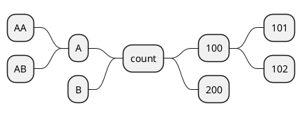
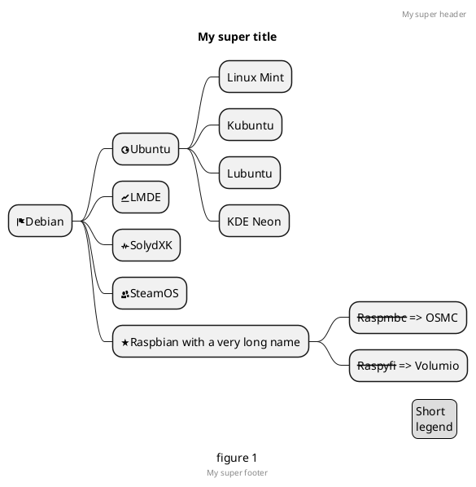

```plantuml
@startmindmap
* root node
** some first level node
***_ second level node
***_ another second level node
***_ foo
***_ bar
***_ foobar
** another first level node
@endmindmap

```

```plantuml
@startmindmap
*_ root node
**_ some first level node
***_ second level node
***_ another second level node
***_ foo
***_ bar
***_ foobar
**_ another first level node
@endmindmap

```

```plantuml
@startmindmap
+ root node
++ some first level node
+++_ second level node
+++_ another second level node
+++_ foo
+++_ bar
+++_ foobar
++_ another first level node
-- some first right level node
--_ another first right level node
@endmindmap

```

```plantuml
@startmindmap
* count
** 100
*** 101
*** 102
** 200

left side

** A
*** AA
*** AB
** B
@endmindmap

```

```plantuml
@startmindmap
caption figure 1
title My super title

* <&flag>Debian
** <&globe>Ubuntu
*** Linux Mint
*** Kubuntu
*** Lubuntu
*** KDE Neon
** <&graph>LMDE
** <&pulse>SolydXK
** <&people>SteamOS
** <&star>Raspbian with a very long name
*** <s>Raspmbc</s> => OSMC
*** <s>Raspyfi</s> => Volumio

header
My super header
endheader

center footer My super footer

legend right
  Short
  legend
endlegend
@endmindmap

```