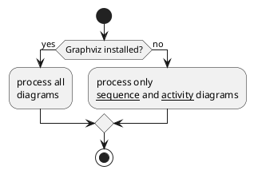
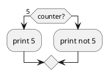
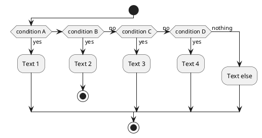
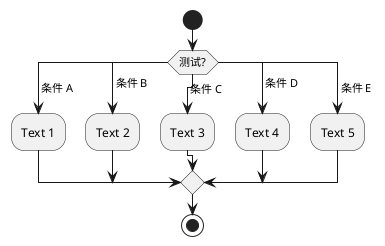
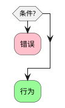
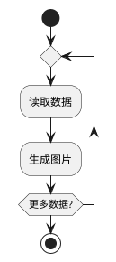
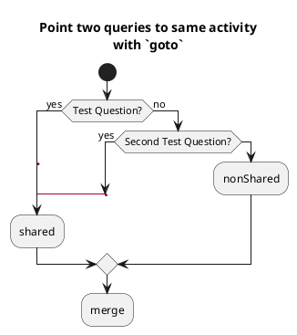
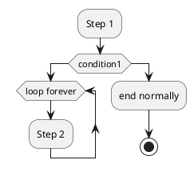
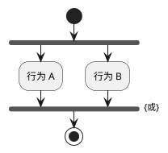

```plantuml
@startuml

start

if (Graphviz installed?) then (yes)
  :process all\ndiagrams;
else (no)
  :process only
  __sequence__ and __activity__ diagrams;
endif

stop

@enduml

```

```plantuml
@startuml
if (counter?) equals (5) then
:print 5;
else 
:print not 5;
@enduml

```

```plantuml
@startuml
start
if (condition A) then (yes)
  :Text 1;
elseif (condition B) then (yes)
  :Text 2;
  stop
(no) elseif (condition C) then (yes)
  :Text 3;
(no) elseif (condition D) then (yes)
  :Text 4;
else (nothing)
  :Text else;
endif
stop
@enduml

```

```plantuml
@startuml
start
switch (测试?)
case ( 条件 A )
  :Text 1;
case ( 条件 B ) 
  :Text 2;
case ( 条件 C )
  :Text 3;
case ( 条件 D )
  :Text 4;
case ( 条件 E )
  :Text 5;
endswitch
stop
@enduml

```

```plantuml
@startuml
if (条件?) then
  #pink:错误;
  kill
endif
#palegreen:行为;
@enduml

```

```plantuml
@startuml

start

repeat
  :读取数据;
  :生成图片;
repeat while (更多数据?)

stop

@enduml

```

```plantuml
@startuml
title Point two queries to same activity\nwith `goto`
start
if (Test Question?) then (yes)
'space label only for alignment
label sp_lab0
label sp_lab1
'real label
label lab
:shared;
else (no)
if (Second Test Question?) then (yes)
label sp_lab2
goto sp_lab1
else
:nonShared;
endif
endif
:merge;
@enduml

```

```plantuml
@startuml
:Step 1;
if (condition1) then
  while (loop forever)
   :Step 2;
  endwhile
  -[hidden]->
  detach
else
  :end normally;
  stop
endif
@enduml

```

```plantuml
@startuml
start
fork
  :行为 A;
fork again
  :行为 B;
end fork {或}
stop
@enduml

```

