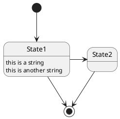
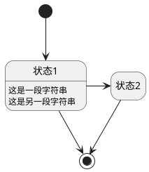
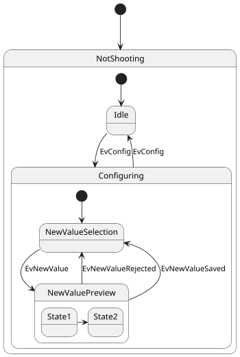
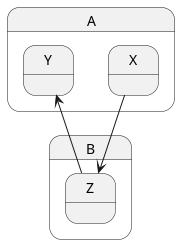
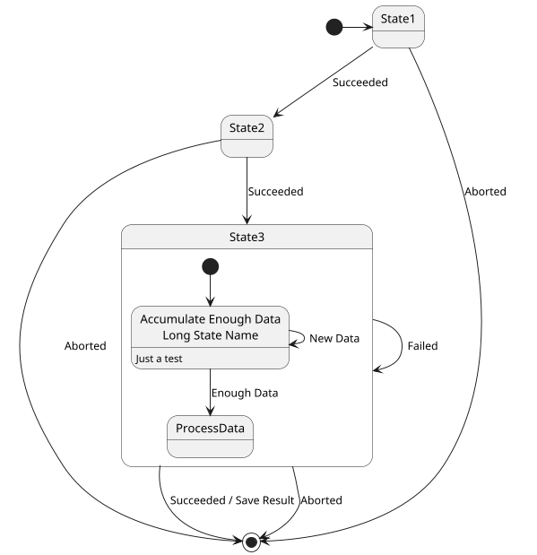
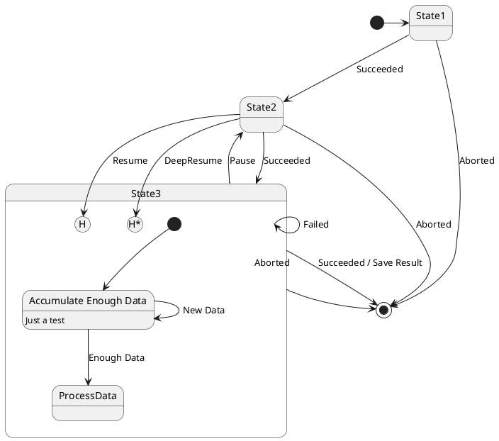
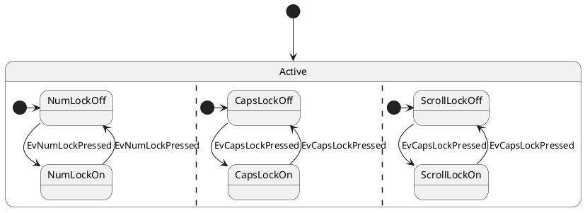
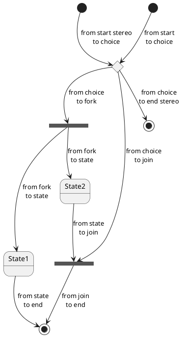

```plantuml
@startuml

[*] --> State1
State1 --> [*]
State1 : this is a string
State1 : this is another string

State1 -> State2
State2 --> [*]

@enduml

```

```plantuml
@startuml
hide empty description
[*] --> 状态1
状态1 --> [*]
状态1 : 这是一段字符串
状态1 : 这是另一段字符串

状态1 -> 状态2
状态2 --> [*]
@enduml

```

```plantuml
@startuml
scale 350 width
[*] --> NotShooting

state NotShooting {
  [*] --> Idle
  Idle --> Configuring : EvConfig
  Configuring --> Idle : EvConfig
}

state Configuring {
  [*] --> NewValueSelection
  NewValueSelection --> NewValuePreview : EvNewValue
  NewValuePreview --> NewValueSelection : EvNewValueRejected
  NewValuePreview --> NewValueSelection : EvNewValueSaved

  state NewValuePreview {
     State1 -> State2
  }

}
@enduml

```

```plantuml
@startuml
state A {
  state X {
  }
  state Y {
  }
}
 
state B {
  state Z {
  }
}

X --> Z
Z --> Y
@enduml

```

```plantuml
@startuml
scale 600 width

[*] -> State1
State1 --> State2 : Succeeded
State1 --> [*] : Aborted
State2 --> State3 : Succeeded
State2 --> [*] : Aborted
state State3 {
  state "Accumulate Enough Data\nLong State Name" as long1
  long1 : Just a test
  [*] --> long1
  long1 --> long1 : New Data
  long1 --> ProcessData : Enough Data
}
State3 --> State3 : Failed
State3 --> [*] : Succeeded / Save Result
State3 --> [*] : Aborted

@enduml

```

```plantuml
@startuml
[*] -> State1
State1 --> State2 : Succeeded
State1 --> [*] : Aborted
State2 --> State3 : Succeeded
State2 --> [*] : Aborted
state State3 {
  state "Accumulate Enough Data" as long1
  long1 : Just a test
  [*] --> long1
  long1 --> long1 : New Data
  long1 --> ProcessData : Enough Data
  State2 --> [H]: Resume
}
State3 --> State2 : Pause
State2 --> State3[H*]: DeepResume
State3 --> State3 : Failed
State3 --> [*] : Succeeded / Save Result
State3 --> [*] : Aborted
@enduml

```

```plantuml
@startuml
[*] --> Active

state Active {
  [*] -> NumLockOff
  NumLockOff --> NumLockOn : EvNumLockPressed
  NumLockOn --> NumLockOff : EvNumLockPressed
  ||
  [*] -> CapsLockOff
  CapsLockOff --> CapsLockOn : EvCapsLockPressed
  CapsLockOn --> CapsLockOff : EvCapsLockPressed
  ||
  [*] -> ScrollLockOff
  ScrollLockOff --> ScrollLockOn : EvCapsLockPressed
  ScrollLockOn --> ScrollLockOff : EvCapsLockPressed
}

@enduml

```

```plantuml
@startuml
state start1  <<start>>
state choice1 <<choice>>
state fork1   <<fork>>
state join2   <<join>>
state end3    <<end>>

[*]     --> choice1 : from start\nto choice
start1  --> choice1 : from start stereo\nto choice

choice1 --> fork1   : from choice\nto fork
choice1 --> join2   : from choice\nto join
choice1 --> end3    : from choice\nto end stereo

fork1   ---> State1 : from fork\nto state
fork1   --> State2  : from fork\nto state

State2  --> join2   : from state\nto join
State1  --> [*]     : from state\nto end

join2   --> [*]     : from join\nto end
@enduml

```

