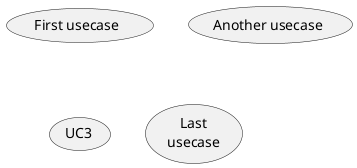
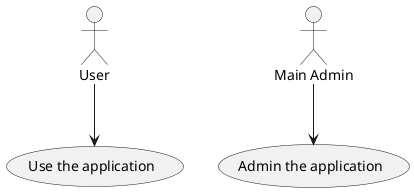
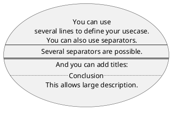
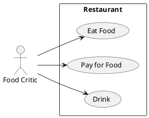
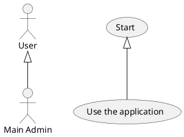
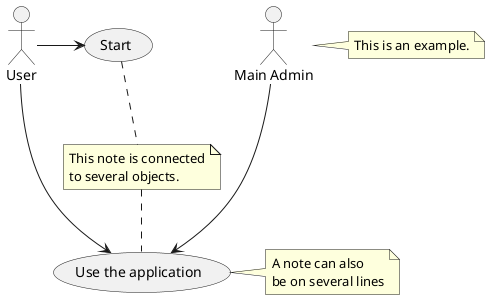
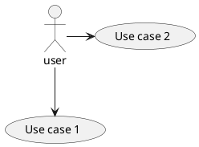
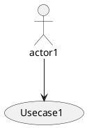
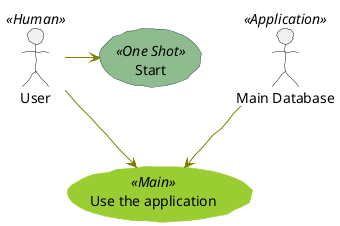

```plantuml
@startuml

(First usecase)
(Another usecase) as (UC2)
usecase UC3
usecase (Last\nusecase) as UC4

@enduml

```

```plantuml
@startuml
:User: --> (Use)
"Main Admin" as Admin
"Use the application" as (Use)
Admin --> (Admin the application)
@enduml

```

```plantuml
@startuml

usecase UC1 as "You can use
several lines to define your usecase.
You can also use separators.
--
Several separators are possible.
==
And you can add titles:
..Conclusion..
This allows large description."

@enduml

```

```plantuml
@startuml
left to right direction
actor "Food Critic" as fc
rectangle Restaurant {
  usecase "Eat Food" as UC1
  usecase "Pay for Food" as UC2
  usecase "Drink" as UC3
}
fc --> UC1
fc --> UC2
fc --> UC3
@enduml

```

```plantuml
@startuml
:Main Admin: as Admin
(Use the application) as (Use)

User <|-- Admin
(Start) <|-- (Use)

@enduml

```

```plantuml
@startuml
:Main Admin: as Admin
(Use the application) as (Use)

User -> (Start)
User --> (Use)

Admin ---> (Use)

note right of Admin : This is an example.

note right of (Use)
  A note can also
  be on several lines
end note

note "This note is connected\nto several objects." as N2
(Start) .. N2
N2 .. (Use)
@enduml

```

```plantuml
@startuml
:user: --> (Use case 1)
:user: -> (Use case 2)
@enduml

```

```plantuml
@startuml
:actor1: --> (Usecase1)
newpage
:actor2: --> (Usecase2)
@enduml

```

```plantuml
@startuml
skinparam handwritten true

skinparam usecase {
BackgroundColor DarkSeaGreen
BorderColor DarkSlateGray

BackgroundColor<< Main >> YellowGreen
BorderColor<< Main >> YellowGreen

ArrowColor Olive
ActorBorderColor black
ActorFontName Courier

ActorBackgroundColor<< Human >> Gold
}

User << Human >>
:Main Database: as MySql << Application >>
(Start) << One Shot >>
(Use the application) as (Use) << Main >>

User -> (Start)
User --> (Use)

MySql --> (Use)

@enduml

```

